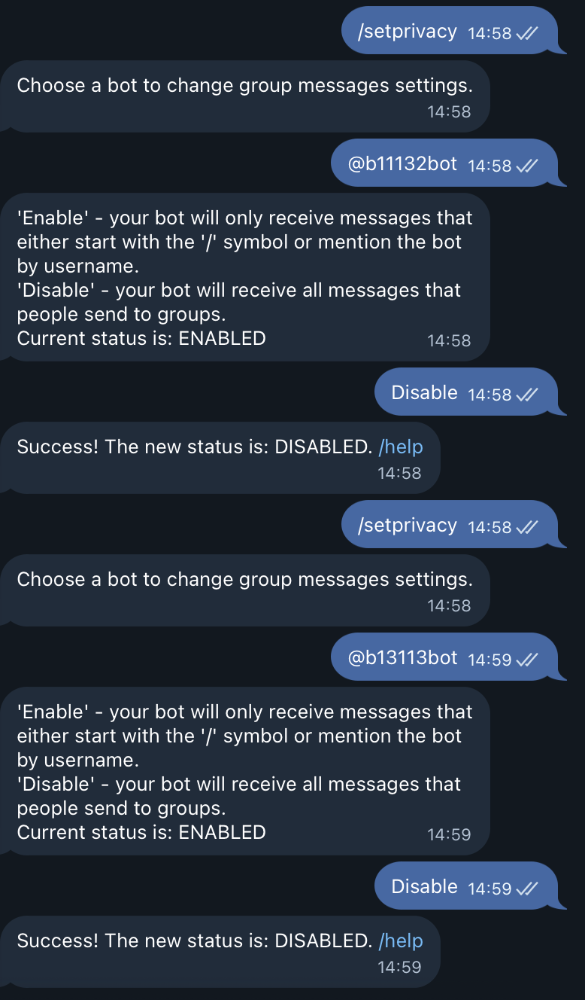
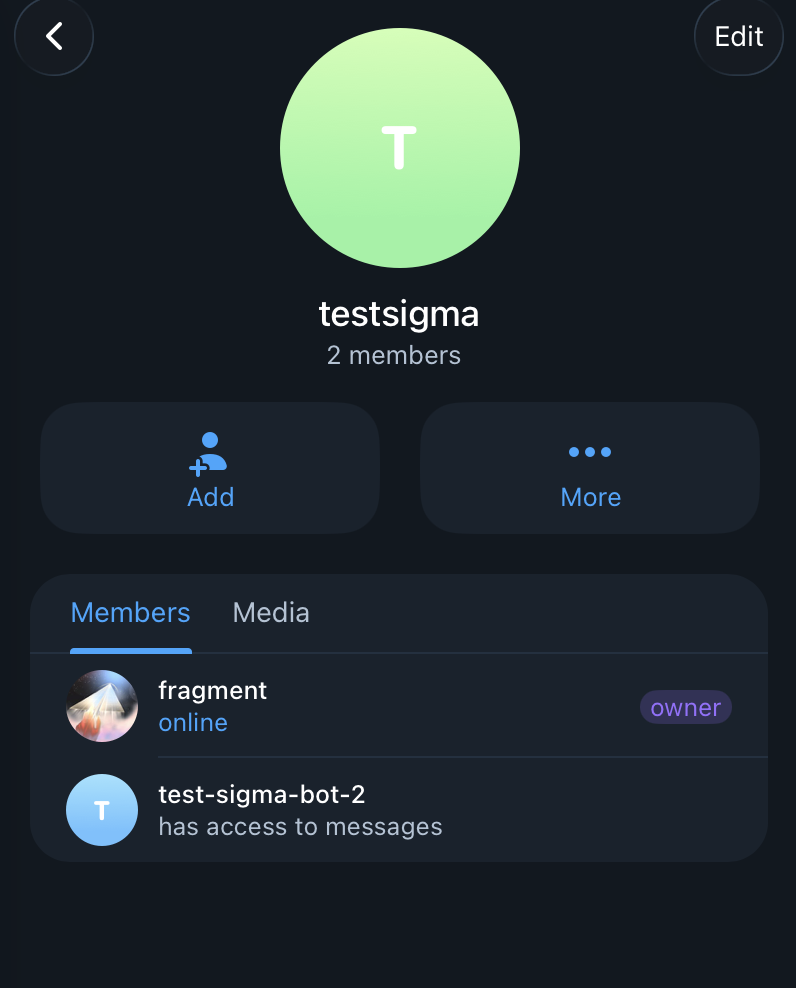
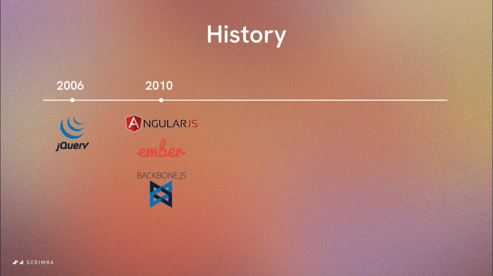
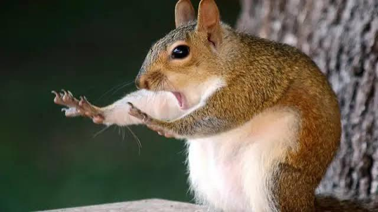
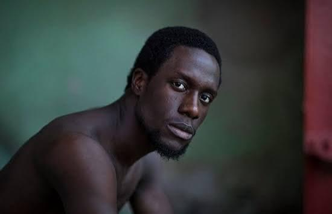

# Отчёт: проверка в реальном Telegram

Сквозная проверка сервиса на настоящих ботах и группе Telegram: фото отправлялись из обычного клиента Telegram,
сервис работал локально в `docker compose`, результаты проверялись по журналу (`GET /messages`), таблице отметок
и выгруженному табелю. В таблицах сценариев — фото, которые отправлялись в чат; подпись и время отправки взяты
из журнала сервиса (на самих фото их нет). Картинки — произвольные тестовые, а не реальные фото заступления.

| | |
|---|---|
| Дата | 01.10.2026, 15:22–15:46 МСК |
| Версия | коммит `238afd3` (все 10 шагов плана, 208 автотестов зелёные) |
| Окружение | macOS, Docker Desktop, `docker compose up` (app + postgres), `WORKERS=2`, `POLL_INTERVAL=1.0` |
| Боты | `@b11132bot` (test-sigma-bot-2) — в группе; `@b13113bot` (test-sigma-bot-1) — поллинг запущен, в группу не добавлен |
| Группа | `testsigma`, обычная группа (не супергруппа), `chat_id = -5461478781` |
| Отправитель | аккаунт тестировщика (`tg_user_id 5088…3374`) |

**Итог: 13 сценариев из 13 пройдены.** 14 фото и 1 текст доставлены и обработаны, ни одно событие не потеряно,
в табеле ровно 3 отметки — по одной на сотрудника, подтверждённого автоматически или оператором.

## 1. Подготовка

1. В BotFather у обоих ботов выключен privacy mode (`/setprivacy` → Disable), иначе бот не видит обычные фото
   в группе. Проверено через Bot API: `getMe` → `can_read_all_group_messages = true` у обоих.

   

2. Создана группа `testsigma`, в неё добавлен `@b11132bot` — Telegram показывает «has access to messages».

   

3. Токены ботов — в `.env` (`BOT_TOKENS`, через запятую), сервис перезапущен. В логе:
   ```
   Run polling for bot @b13113bot id=8281234034 - 'test-sigma-bot-1'
   Run polling for bot @b11132bot id=8623192177 - 'test-sigma-bot-2'
   ```

4. Первое фото отправлено в ещё не зарегистрированную группу — оно сохранилось как `rejected / unknown_group`,
   и из журнала взяты `chat_id` группы и `tg_user_id` отправителя.

   

5. Справочники заведены через API:
   - группа `testsigma`, окно отметки `00:00–23:59` МСК (на время теста — весь день);
   - сотрудники: Мехоношин Алексей Петрович, Иванов Иван, Иванов Пётр (однофамильцы), Петров Сергей;
   - во втором раунде аккаунт тестировщика привязан к Петрову Сергею (`PUT /bindings/{tg_user_id}`).

## 2. Сценарии и результаты

Время — московское, время отправки взято из Telegram (`message.date`). Автоматическая обработка занимала не больше
1 секунды от отправки (интервал опроса очереди воркером).

### Раунд 1 — определение по подписи, аккаунт не привязан

| № | Фото | Время | Что отправлено | Ожидалось | Получено | Отметка в табеле | |
|---|---|---|---|---|---|---|---|
| 1 |  | 15:28:11 | фото без подписи, группа ещё не зарегистрирована | `rejected / unknown_group` | `rejected / unknown_group` | — | ✅ |
| 2 |  | 15:34:34 | фото «мехоношин» | `accepted / by_caption` | `accepted / by_caption` | Мехоношин, 01.10 | ✅ |
| 3 |  | 15:34:45 | ещё одно фото «мехоношин» | `duplicate / already_marked` | `duplicate / already_marked` | вторая не создана | ✅ |
| 4 |  | 15:34:58 | фото «Иванов» (два Иванова) | `manual_review / ambiguous_surname` | `manual_review / ambiguous_surname` | — | ✅ |
| 5 |  | 15:35:37 | фото «Мехоношин и Петров» | `manual_review / multiple_employees` | `manual_review / multiple_employees` | — | ✅ |
| 6 |  | 15:35:48 | фото без подписи | `manual_review / no_caption` | `manual_review / no_caption` | — | ✅ |
| 7 |  | 15:36:00 | фото «на пост» | `manual_review / employee_not_found` | `manual_review / employee_not_found` | — | ✅ |
| 8 |    | 15:37:02 | альбом из 3 фото без подписи | каждое `rejected / album_part_without_caption` | все 3 — `rejected / album_part_without_caption` | — | ✅ |
| 9 | — (текст) | 15:37:12 | текст «Петров» (без фото) | в журнал не попадает | не попал (в логе бота «not handled») | — | ✅ |

### Раунд 2 — аккаунт привязан к Петрову Сергею

| № | Фото | Время | Что отправлено | Ожидалось | Получено | Отметка в табеле | |
|---|---|---|---|---|---|---|---|
| 10 |  | 15:38:17 | фото без подписи | `accepted / by_account` | `accepted / by_account` → Петров Сергей | Петров, 01.10 | ✅ |
| 11 |  | 15:38:37 | фото «мехоношин» | `manual_review / caption_account_mismatch` | `manual_review / caption_account_mismatch` | — | ✅ |
| 12 |  | 15:38:53 | фото «Петров» | `duplicate / already_marked` (подпись и аккаунт совпали, но Петров уже отмечен) | `duplicate / already_marked` | вторая не создана | ✅ |

### Раунд 3 — окно отметки

Окно группы через `POST /groups` сужено до `07:00–10:00` МСК, после проверки возвращено обратно.

| № | Фото | Время | Что отправлено | Ожидалось | Получено | Отметка в табеле | |
|---|---|---|---|---|---|---|---|
| 13 |  | 15:43:36 | фото «Иванов» | `rejected / outside_window` | `rejected / outside_window` | — | ✅ |

## 3. Ручная проверка

На ручной проверке оказалось 5 сообщений группы (`GET /review`). Решения оператора (15:44):

| Сообщение | Причина проверки | Решение оператора | Результат |
|---|---|---|---|
| «Иванов» (№4) | `ambiguous_surname` | approve → Иванов Иван | `accepted / manual_approved`, отметка с `manual = true` |
| «Мехоношин и Петров» (№5) | `multiple_employees` | approve → Мехоношин | `duplicate / already_marked` — Мехоношин уже отмечен в №2, вторая отметка не создана |
| без подписи (№6) | `no_caption` | reject | `rejected / manual_rejected` |
| «на пост» (№7) | `employee_not_found` | reject | `rejected / manual_rejected` |
| «мехоношин» с аккаунта Петрова (№11) | `caption_account_mismatch` | reject | `rejected / manual_rejected` |
| «Иванов» (№4) повторно | — | approve → Иванов Пётр | **HTTP 409**: «сообщение в статусе accepted, ожидается manual_review» |

После решений очередь ручной проверки по группе пуста.

## 4. Табель

`GET /timesheet?month=2026-10&chat_id=-5461478781` → `timesheet-2026-10--5461478781.xlsx`, заголовок
«Табель за октябрь 2026 — testsigma». Содержимое (дни 2–31 пустые, опущены):

| Ф.И.О. | 1 | … | кол. смен |
|---|---|---|---|
| Иванов Иван | 1 | | `=SUM(B3:AF3)` → 1 |
| Мехоношин Алексей Петрович | 1 | | `=SUM(B4:AF4)` → 1 |
| Петров Сергей | 1 | | `=SUM(B5:AF5)` → 1 |
| **ИТОГ:** | `=SUM(B3:B5)` → 3 | | `=SUM(AG3:AG5)` → 3 |

Отметки в базе (`attendance`) — ровно 3, каждая ссылается на подтверждающее сообщение:

| Сотрудник | Дата смены | Основание | Ручная |
|---|---|---|---|
| Мехоношин Алексей Петрович | 01.10.2026 | №2, фото «мехоношин», 15:34:34 | нет |
| Петров Сергей | 01.10.2026 | №10, фото без подписи по привязке, 15:38:17 | нет |
| Иванов Иван | 01.10.2026 | №4, фото «Иванов», подтверждено оператором 15:44:01 | да |

Файл табеля приложен: [`telegram-test/timesheet-2026-10-testsigma.xlsx`](telegram-test/timesheet-2026-10-testsigma.xlsx). Формулы
сохраняются без вычисленных значений: Excel и LibreOffice пересчитывают их при открытии, превью Quick Look показывает нули.

## 5. Журнал обработки (полностью)

`GET /messages` по группе `testsigma`. «Обработано» — время итогового статуса: у спорных сообщений — время решения
оператора. Ссылок на первоисточник нет: `testsigma` — обычная группа, ссылки `t.me/c/…` есть только у супергрупп.

| id | message_id | Подпись | Отправлено | Обработано | Статус | Причина | Сотрудник | Дата смены |
|---|---|---|---|---|---|---|---|---|
| 7 | 5 | — | 15:28:11 | 15:28:11 | rejected | unknown_group | | |
| 8 | 6 | мехоношин | 15:34:34 | 15:34:34 | accepted | by_caption | Мехоношин А. П. | 01.10.2026 |
| 9 | 7 | мехоношин | 15:34:45 | 15:34:45 | duplicate | already_marked | Мехоношин А. П. | 01.10.2026 |
| 10 | 8 | Иванов | 15:34:58 | 15:44:01 | accepted | manual_approved | Иванов Иван | 01.10.2026 |
| 11 | 9 | Мехоношин и Петров | 15:35:37 | 15:44:01 | duplicate | already_marked | Мехоношин А. П. | 01.10.2026 |
| 12 | 10 | — | 15:35:48 | 15:44:01 | rejected | manual_rejected | | 01.10.2026 |
| 13 | 11 | на пост | 15:36:00 | 15:44:01 | rejected | manual_rejected | | 01.10.2026 |
| 14 | 13 | — (альбом) | 15:37:02 | 15:37:03 | rejected | album_part_without_caption | | 01.10.2026 |
| 15 | 12 | — (альбом) | 15:37:02 | 15:37:03 | rejected | album_part_without_caption | | 01.10.2026 |
| 16 | 14 | — (альбом) | 15:37:02 | 15:37:03 | rejected | album_part_without_caption | | 01.10.2026 |
| 17 | 16 | — | 15:38:17 | 15:38:18 | accepted | by_account | Петров Сергей | 01.10.2026 |
| 18 | 17 | мехоношин | 15:38:37 | 15:44:01 | rejected | manual_rejected | | 01.10.2026 |
| 19 | 18 | Петров | 15:38:53 | 15:38:54 | duplicate | already_marked | Петров Сергей | 01.10.2026 |
| 20 | 19 | Иванов | 15:43:36 | 15:43:36 | rejected | outside_window | | |

Пропуск `message_id = 15` в журнале — это текст «Петров» (№9): он не фото и намеренно не сохраняется.

## 6. Логи бота

Бот `@b11132bot` за время теста получил 17 апдейтов:

| Апдейты | Сколько | Что это |
|---|---|---|
| обработаны хендлером | 14 | 14 фото → 14 строк в журнале (3 из них — альбом, пришли одновременно в 15:37:02) |
| не обработаны («not handled») | 3 | 15:25:00 — служебное сообщение о добавлении бота в группу; 15:25:26 — сообщение без фото (тип содержимого сервис не логирует; вероятно, картинка, отправленная файлом, — такие намеренно не обрабатываются); 15:37:12 — текст «Петров» (№9) |

В 15:32 соединение с Telegram дважды обрывалось (`TelegramNetworkError: Server disconnected`). aiogram
переподключился через 1 попытку (`Connection established (tryings = 1)`), ни одно сообщение не потерялось —
все фото, отправленные после обрыва, есть в журнале.

## 7. Что не проверено вживую

| Что | Почему | Чем покрыто |
|---|---|---|
| Два бота в одной группе (одно сообщение приходит дважды) | второй бот не добавлен в группу | интеграционный тест: 10 одновременных доставок одного сообщения → 1 строка |
| Ссылка на первоисточник `t.me/c/…` | `testsigma` — обычная группа | HTTP-тест журнала на супергруппе; проверено в docker-прогоне на имитированных сообщениях |
| Окно через полночь, другие таймзоны | для живой проверки нужно ждать ночи | unit-тесты `shift_date` и `decide` |
| Приём сообщений, пока сервис остановлен | не проводился | поведение Bot API: неподтверждённые апдейты хранятся до 24 ч и приходят после старта поллинга |
| Сбой БД во время приёма, параллельные воркеры | требует имитации отказов | тесты повторов `IngestService`, изоляции ошибок, 2 воркера × 200 сообщений на Postgres |

## 8. Замечания по итогам

1. **Имя файла табеля для обычных групп** — `timesheet-2026-10--5461478781.xlsx`: двойной дефис из-за отрицательного
   `chat_id`. На работу не влияет, косметика.
2. **Картинка, отправленная файлом, молча игнорируется.** По ТЗ первой версии обрабатываются только фото; так и
   задумано, но пользователю в чате это не видно. Варианты на будущее — обрабатывать изображения-документы или
   писать такие сообщения в журнал со статусом `rejected`.
3. **Бот молчит в чате** — результат виден только оператору через API. Для пилота можно добавить реакцию бота на
   фото (👍 принято, 🤔 на проверке) за флагом в настройках.
